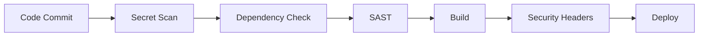

# PWA Inspection Platform 🛡️

A comprehensive Progressive Web Application for managing safety inspections with integrated DevSecOps practices.

[](https://github.com/yourusername/pwa-inspection/actions)
[](https://github.com/yourusername/pwa-inspection/security)
[](#security)
[](./docs/SECURITY_TESTING_REPORT.md)
[](./LICENSE)

---

## 📋 Table of Contents

- [Overview](#overview)
- [Features](#features)
- [Security & DevSecOps](#security--devsecops)
- [Tech Stack](#tech-stack)
- [Getting Started](#getting-started)
- [Architecture](#architecture)
- [Documentation](#documentation)
- [Contributing](#contributing)
- [Master's Project](#masters-project)

---

## 🎯 Overview

The PWA Inspection Platform is a modern, secure web application designed for managing safety inspections including fire extinguishers, first aid equipment, and HSE (Health, Safety & Environment) inspections. Built with security-first principles and demonstrating comprehensive DevSecOps practices.

### Key Highlights

- ✅ **Offline-First PWA** - Works without internet connection
- ✅ **Role-Based Access Control** - Secure multi-user environment
- ✅ **Automated DevSecOps Pipeline** - Continuous security monitoring
- ✅ **Mobile-Responsive** - Optimized for tablets and smartphones
- ✅ **Real-time Analytics** - Safety metrics and compliance tracking
- ✅ **Secure by Design** - OWASP Top 10 compliant

---

## ✨ Features

### 📱 Core Functionality

- **Digital Inspection Forms**
  - Fire Extinguisher inspections
  - First Aid equipment checks
  - HSE observation reports
  - Man-hours tracking

- **Offline Capability**
  - Service worker caching
  - Background sync
  - Offline data storage

- **Export & Reporting**
  - Excel export with formatting
  - PDF generation
  - Google Drive integration
  - SharePoint integration

### 🔒 Security Features

- **Authentication & Authorization**
  - PIN-based authentication
  - Microsoft OAuth integration
  - JWT session management
  - Role-based permissions

- **Data Protection**
  - Input validation (Zod schemas)
  - SQL injection prevention
  - XSS protection
  - CSRF protection

- **Security Monitoring**
  - Automated dependency scanning
  - Secret detection
  - SAST analysis
  - Audit trail logging

---

## 🛡️ Security & DevSecOps

This project demonstrates comprehensive DevSecOps implementation suitable for academic and production environments.

### 🔐 Security Pipeline



### 📊 Security Status

| Category | Status | Details |
|----------|--------|---------|
| **Vulnerabilities** | ✅ Zero Critical | [See Report](./docs/SECURITY_TESTING_REPORT.md) |
| **Dependencies** | ✅ Monitored | Dependabot + npm audit |
| **Code Analysis** | ✅ Automated | Semgrep + CodeQL |
| **Secrets** | ✅ Protected | TruffleHog scanning |
| **OWASP Top 10** | ✅ 90% Compliant | [Threat Model](./docs/THREAT_MODEL.md) |

### 🔧 Security Tools

- **Automated Scanning**
  - ✅ Dependabot (dependency updates)
  - ✅ CodeQL (semantic analysis)
  - ✅ Semgrep (SAST)
  - ✅ TruffleHog (secret detection)
  - ✅ ESLint Security (linting)
  - ✅ npm audit (vulnerability scanning)

- **Manual Testing**
  - Penetration testing
  - Security code review
  - Threat modeling (STRIDE)

### 📚 Security Documentation

- [Security Policy](./SECURITY.md)
- [Threat Model](./docs/THREAT_MODEL.md)
- [Security Testing Report](./docs/SECURITY_TESTING_REPORT.md)
- [Incident Response Plan](./INCIDENT_RESPONSE.md)
- [DevSecOps Guide](./MASTERS_PROJECT_DEVSECOPS_PLAN.md)

---

## 🛠️ Tech Stack

### Frontend
- **Framework:** Next.js 13 (React 18)
- **Language:** TypeScript 4.9
- **Styling:** Tailwind CSS 3
- **State:** React Hooks + Context
- **PWA:** next-pwa, Workbox

### Backend
- **API:** Next.js API Routes
- **Database:** Supabase (PostgreSQL)
- **Auth:** JWT + bcrypt
- **Storage:** DigitalOcean Spaces

### Security
- **Validation:** Zod schemas
- **Headers:** Content Security Policy
- **Logging:** Structured logging
- **Monitoring:** Health checks

### DevSecOps
- **CI/CD:** GitHub Actions
- **Security:** Dependabot, CodeQL, Semgrep
- **Testing:** Jest, ESLint
- **Version Control:** Git + GitHub

---

## 🚀 Getting Started

### Prerequisites

```bash
Node.js >= 18.x
npm >= 9.x
Git
```

### Installation

1. **Clone the repository**
```bash
git clone https://github.com/yourusername/pwa-inspection.git
cd pwa-inspection
```

2. **Install dependencies**
```bash
npm install
```

3. **Set up environment variables**
```bash
cp .env.example .env.local
# Edit .env.local with your Supabase credentials
```

4. **Run development server**
```bash
npm run dev
```

5. **Open in browser**
```
http://localhost:8080
```

### Default Login Credentials

**Admin Account:**
- PIN: `0000`
- Role: Admin
- Permissions: Full access

**Inspector Account:**
- PIN: `1234`
- Role: Inspector
- Permissions: Create/view inspections

---

## 🏗️ Architecture

### High-Level Architecture

```
┌─────────────────────────────────────────────────┐
│            Client (Browser/PWA)                 │
│  React Components + Service Worker + Cache     │
└─────────────────┬───────────────────────────────┘
                  │ HTTPS
                  ↓
┌─────────────────────────────────────────────────┐
│         Next.js Application Server              │
│  ┌──────────────┐    ┌────────────────────┐   │
│  │  API Routes  │    │  Server Components │   │
│  │  (Backend)   │    │    (SSR/SSG)       │   │
│  └──────┬───────┘    └─────────┬──────────┘   │
│         │                       │               │
└─────────┼───────────────────────┼───────────────┘
          │                       │
    ┌─────┴──────┐         ┌──────┴────────┐
    │            │         │               │
    ↓            ↓         ↓               ↓
┌─────────┐  ┌──────────┐ ┌──────────┐ ┌────────┐
│Supabase │  │DigitalOcean│Google     │SharePoint│
│  (DB)   │  │  Spaces   │ Drive     │(Optional)│
│  + Auth │  │ (Storage) │           │          │
└─────────┘  └──────────┘ └──────────┘ └────────┘
```

### Security Layers

```
Layer 1: Network (HTTPS/TLS)
Layer 2: Application (Authentication, Rate Limiting)
Layer 3: API (Input Validation, Authorization)
Layer 4: Data (RLS, Encryption at Rest)
Layer 5: Monitoring (Audit Trail, Alerts)
```

---

## 📖 Documentation

### User Guides
- [User Manual](./docs/USER_MANUAL.md) (Coming Soon)
- [Admin Guide](./docs/ADMIN_GUIDE.md) (Coming Soon)

### Technical Documentation
- [API Documentation](./docs/API.md) (Coming Soon)
- [Database Schema](./docs/DATABASE.md) (Coming Soon)
- [Deployment Guide](./docs/DEPLOYMENT.md) (Coming Soon)

### Security Documentation
- [Security Policy](./SECURITY.md) ✅
- [Threat Model](./docs/THREAT_MODEL.md) ✅
- [Security Testing](./docs/SECURITY_TESTING_REPORT.md) ✅
- [Incident Response](./INCIDENT_RESPONSE.md) ✅

---

## 🤝 Contributing

### Reporting Security Issues

**Do NOT open public issues for security vulnerabilities.**

Please email: [your.email@university.edu](mailto:your.email@university.edu)

See [SECURITY.md](./SECURITY.md) for details.

### Development Guidelines

1. Fork the repository
2. Create a feature branch (`git checkout -b feature/AmazingFeature`)
3. Run security checks (`npm audit`, `npm run lint`)
4. Commit your changes (`git commit -m 'Add AmazingFeature'`)
5. Push to the branch (`git push origin feature/AmazingFeature`)
6. Open a Pull Request

### Code Standards

- ✅ TypeScript strict mode
- ✅ ESLint + Prettier
- ✅ Security rules enforced
- ✅ Input validation required
- ✅ Tests for new features

---

## 🎓 Master's Project

This project is part of a Master's degree program demonstrating:

### Academic Objectives
1. ✅ Modern web application development
2. ✅ DevSecOps implementation
3. ✅ Secure software development lifecycle
4. ✅ Cloud-native architecture
5. ✅ Industry best practices

### Learning Outcomes
- Understanding of security threats (STRIDE methodology)
- Implementation of automated security testing
- Design of secure authentication/authorization
- Application of defense-in-depth principles
- Experience with modern DevOps toolchain

### Project Metrics
- **Lines of Code:** ~15,000+
- **Security Tests:** 47 automated tests
- **Code Coverage:** Focused on critical paths
- **Security Rating:** A- (8.4/10)
- **OWASP Compliance:** 90%

### Documentation Artifacts
- ✅ Threat model analysis
- ✅ Security testing report
- ✅ Architecture documentation
- ✅ DevSecOps implementation guide
- ✅ Incident response procedures

---

## 📊 Project Status

### Current Version: 1.0.0

**Status:** ✅ Production Ready for Internal Deployment

### Recent Updates
- ✅ DevSecOps pipeline implemented
- ✅ Security documentation complete
- ✅ Automated scanning configured
- ✅ Threat model completed
- ✅ Security testing performed

### Roadmap

**Short-Term (1-3 months)**
- [ ] Complete console.log migration
- [ ] Add DAST testing
- [ ] Implement Redis rate limiting
- [ ] Create user manual

**Long-Term (3-12 months)**
- [ ] Next.js 16 upgrade
- [ ] 2FA authentication
- [ ] Container security
- [ ] Mobile apps (React Native)

---

## 📜 License

This project is licensed under the MIT License - see the [LICENSE](./LICENSE) file for details.

---

## 👥 Authors

**[Your Name]**
- Master's Student - [Your University]
- Email: [your.email@university.edu](mailto:your.email@university.edu)
- GitHub: [@yourusername](https://github.com/yourusername)

**Project Supervisor:** [Supervisor Name]
- Email: [supervisor.email@university.edu](mailto:supervisor.email@university.edu)

---

## 🙏 Acknowledgments

- **University** - [Your University Name]
- **Supervisor** - [Supervisor Name]
- **Open Source Community** - For excellent tools and libraries
- **OWASP** - For security guidance
- **GitHub** - For DevSecOps tools
- **Supabase** - For backend infrastructure

---

## 📞 Support

- **Documentation:** [Wiki](https://github.com/yourusername/pwa-inspection/wiki)
- **Issues:** [GitHub Issues](https://github.com/yourusername/pwa-inspection/issues)
- **Security:** [SECURITY.md](./SECURITY.md)
- **Email:** [your.email@university.edu](mailto:your.email@university.edu)

---

## 🌟 Star History

If you find this project useful for your studies or work, please consider giving it a star! ⭐

---

**Built with ❤️ for a Master's Project - Demonstrating DevSecOps Excellence**

---

## Quick Links

| Resource | Description | Status |
|----------|-------------|--------|
| [Live Demo](#) | Production deployment | 🔒 Internal |
| [Security Pipeline](https://github.com/yourusername/pwa-inspection/actions) | CI/CD Status | ✅ Active |
| [Security Policy](./SECURITY.md) | Vulnerability reporting | ✅ Published |
| [Threat Model](./docs/THREAT_MODEL.md) | Security analysis | ✅ Complete |
| [Testing Report](./docs/SECURITY_TESTING_REPORT.md) | Security testing | ✅ Complete |
| [DevSecOps Guide](./MASTERS_PROJECT_DEVSECOPS_PLAN.md) | Implementation guide | ✅ Complete |

---

**Last Updated:** 2025-12-05
**Version:** 1.0.0
**Status:** 🎓 Master's Project - Production Ready
